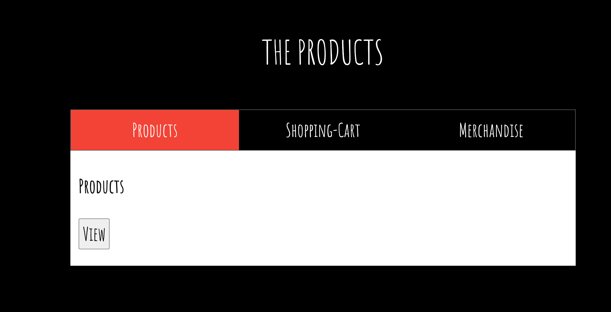
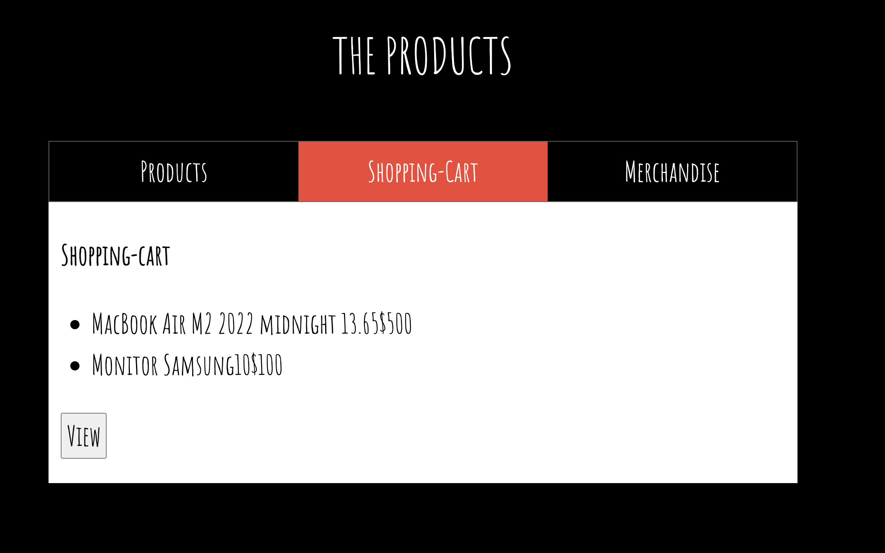

## Despliegue de Aplicaciones 

La empresa ZERO Technology ha lanzado un nuevo proyecto que requiere la implementación de múltiples aplicaciones en un servidor. El objetivo es desplegar tanto el frontend como varios servicios backend utilizando PM2 para gestionar los procesos. Este desafío está diseñado para evaluar tus habilidades en el despliegue de aplicaciones, la configuración del entorno y la automatización.


## **Requerimiento:**

**ZERO Technology** ha solicitado al Equipo de DevOps Trainer SuperPower 🚀 el despliegue de la siguiente solución en un servidor utilizando PM2 para la gestión de procesos:

### Servicios a Desplegar:
**Frontend**
- Descripción: Aplicación web realizada en Express.
- Puerto: 3000

**Backend Products**
- Descripción: Servicio backend para productos realizado en Express.
- Puerto: 3001

**Backend Shopping-Cart**
- Descripción: Servicio backend para carrito de compras realizado en Express.
- Puerto: 3002

**Backend Merchandise**
- Descripción: Servicio backend para mercancías realizado en Express.
- Puerto: 3003

### **Instrucciones del Desafío:**

1. **Preparación del Servidor:**
   - Asegúrate de tener acceso a un servidor Ubuntu (o la distribución de tu elección).
   - Actualiza el sistema y prepara el servidor para la instalación de las herramientas necesarias.

2. **Instalación de Dependencias:**
   - Instala Node.js y npm si no están instalados:
   - Instala PM2 globalmente:
     ```bash
     sudo npm install -g pm2
     ```

3. **Configuración de Aplicaciones:**
   - Clona el repositorio 
   ```bash
    git clone -b ecommerce-ms https://github.com/roxsross/devops-static-web.git
   ```
   - Aplicaciones en ms
   ```bash
    ├── frontend
    │   ├── index.html
    │   ├── package-lock.json
    │   ├── package.json
    │   └── server.js
    ├── merchandise
    │   ├── package-lock.json
    │   ├── package.json
    │   └── server.js
    ├── products
    │   ├── package-lock.json
    │   ├── package.json
    │   └── server.js
    └── shopping-cart
        ├── package-lock.json
        ├── package.json
        └── server.js
   ```
   - Navega al directorio de cada aplicación y realiza la instalación de dependencias:
     ```bash
     npm install
     ```

4. **Despliegue de Aplicaciones:**
   - Utiliza PM2 para iniciar cada aplicación 
   - Verifica que las aplicaciones estén corriendo:
     ```bash
     pm2 list
     ```

5. **Configuración del Servidor Web (opcional):**
   - Si decides configurar un servidor web como Nginx para gestionar el tráfico, instala y configura Nginx para redirigir el tráfico a las aplicaciones:
     ```bash
     sudo apt install nginx
     ```
   - Configura los bloques de servidor en Nginx para redirigir el tráfico a los puertos de las aplicaciones.

6. **Automatización y Monitoreo:**
   - Configura PM2 para reiniciar las aplicaciones automáticamente al reiniciar el servidor:
     ```bash
     pm2 startup
     ```
   - Guarda el estado actual de las aplicaciones para que se restauren al reiniciar el servidor:
     ```bash
     pm2 save
     ```
   - Considera configurar herramientas de monitoreo para verificar el estado y el rendimiento de las aplicaciones.

7. **Pruebas y Validación:**
   - Verifica que todas las aplicaciones estén funcionando correctamente accediendo a los puertos especificados desde un navegador web.
   - Realiza pruebas de funcionalidad para asegurar que los servicios interactúan correctamente.

### **Resultado Esperado:**







¡Buena suerte con el desafío! 🚀 Si necesitas ayuda en cualquier momento, no dudes en solicitarla.


